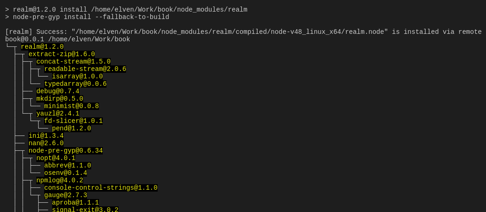
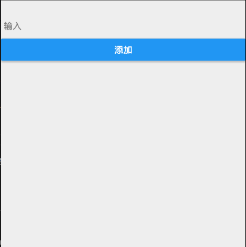

# 储存

本章提要
- AsyncStorage 
- Realm
一个应用总是要存些东西的，我们要怎么做才能把数据存起来呢？我们这里有两个选择，一个是使用官方提供的AsyncStorage另一个是使用小型数据库。

当数据量不大，结构很简单的时候，我们来使用AsyncStorage这个key-value储存系统，当数据量较大的时候，我们就需要使用小型数据库了，这里我们
会学习一个叫做Realm的数据库。

首先，我们来看看AsyncStorage吧~

##  AsyncStorage

与数据打交道，免不了对数据进行增加，删除，更改和查找。我们来看看如何用AsyncStorage实现这些。

增加数据：

```
save(key, value) {
  AsyncStorage.setItem(key,value).then(
    (errs)=>{
      if (!errs) {
        //xxx
      }else {
        //xxx
      }
    })  
}

```

在这里，我们使用了promise，这样会使代码看起来舒服很多。虽然看起来很多，实际上，只要知道

```
AsyncStorage.setItem(key,value)
```

就可以了，我们用`setItem`来将key和value存储起来，看到这里想必你已经知道了为什么AsyncStorage是key-value系统了。

由于有了key，所以我们可以用key进行查询：

```
get(key) {
   AsyncStorage.getItem(key)
            .then(  
                (result)=> {   
                    if (!result) {
                      //xxx
                    }
                    //返回结果
                }
            ).catch((error)=> {  
              //错误处理
        }
}   
```

数据我们存完了，但是如果数据没用了怎么办？删掉呗。和查询数据很像，删除也需要用到key：

```
del(key) {
   AsyncStorage.removeItem(key).
            then(
            ()=>{
              //删除成功
            }
          ).catch((error)=> {  
              //错误处理
        }
}
```

至于修改数据，其实写法和增加数据一样，当你需要修改一项数据的时候，直接传入key和一个新的值就可以了。

## Realm

前面的AsyncStorage只能存些小东西，数据量一大就开始捉襟见肘了，到了这种时候就该用Realm了。
其实用SQLite也行，不过不怎么好用，索性就不用了。当初作者君在用Realm的时候版本号才是0.14转眼间就到1.0.0了，所以请放心的使用Realm吧。

Realm并不是React Native自己就有的，所以我们需要安装Realm：

```
npm install --save realm
```

安装好后大概是这样：

  

然后执行

```
react-native link realm
```

  

装完Realm之后得重新构建一下App：

```
react-native run-android
```

*Tips：由于网络的问题呢，可能会构建失败，多试几次就可以构建完成了*

接下来测试一下Realm是不是安装成功了，先是引入Realm：

```
import Realm from 'realm';
```
下面是Realm官方文档的例子的：

``` 
export default class <project-name> extends Component {
  render() {
    let realm = new Realm({
     schema: [{name: 'Dog', properties: {name: 'string'}}]
   });

   realm.write(() => {
     realm.create('Dog', {name: 'Rex'});
   });
    return (
      <View style={styles.container}>
        <Text style={styles.welcome}>
          Count of Dogs in Realm: {realm.objects('Dog').length}
        </Text>
      </View>
    );
  }
}
```

`<project-name>`是你的项目名称，别弄错了。然后刷新一下，界面上的数字就会加1。如果程序可以顺利运行，
Realm就已经安装好了。

先简单的解释一下上面的代码，首先我们新建了一个叫做Dog的Schema，下面的`write`是写入数据，组件中的
`realm.objects('Dog').length`会返回Dog中的数据个数。每次刷新App，都会写入一条数据，所以数字会加一。

有了一个简单的认识之后，让我们来详细的了解Realm吧！

### Schema

在使用Realm的时候离不开Schema，一个大些的App一般会用到多个Schema，所以在正式使用Realm的时候
不能像上面的例子一样敷衍，我们需要进行一个简单的封装。新建一个叫Schema.js文件，它可以在app文件夹下（没有app文件夹就自己新建一个），

在文件头部引入Realm：

```
import Realm from 'realm';
```

然后创建一个叫Todo的class：

```
class Todo extends Realm.Object {}
```

不喜欢这个名字的话，你可以自己随便起一个名字。

然后来写Schema：

```
Todo.schema = {
    name:'Todo',
    primaryKey: 'id',
    properties: {
        title: {type: 'string'},
        id: {type: 'string', indexed: true},
    }
}
```

这里我们用id来作为主键，由于这个id具有唯一性，我们一会儿会写一个小程序来生成id。 

然后导出模块：

```
export default new Realm({schema: [Todo]})
``` 

如果你需要多个Schema，在后面加上就好：

```
export default new Realm({schema: [Todo, Category, xxx, xxx]})
```

然后在你需要使用储存的地方引入Schema.js。

比如这样引入：

```
import realm from './Schema';
//注意文件位置
```

然后写一个生成id(为了不生成重复的id，我们使用guid，别管这是啥，只要知道这东西一般不会重复就好了)的函数：

```
const guid = () => {
  return 'xxxxxxxx-xxxx-4xxx-yxxx-xxxxxxxxxxxx'
    .replace(/[xy]/g, (c) => {
      var r = Math.random() * 16 | 0, v = c == 'x' ? r : (r & 0x3 | 0x8);
      return v.toString(16);
    });
}
```

接下来，我们来看如何去用Realm（也就是增删改查）。

我们来写一个输入框来收集数据：

```
<TextInput
  style={{ height: 80, width: 200, marginBottom: -20 }}
  placeholder="输入"
  onChangeText={(title) => this.setState({title})}
/>
<Button  title="添加" />
```
  

不出意外的话，下边会有一个黄色的提示（前边的章节有说过），先不要管它，我们一会儿解决。
为了储存数据，我们需要把输入的文字放到state里面，上面的`onChangeText`就是干这个的，对了，别忘记加一个叫title的状态：

```
constructor(props){
      super(props);
      this.state = {
        text: null
      };
    }
```       

Ok，搞定这些后我们来写一个写入数据的方法，我们起名叫write，write应该写在constructor下边：

```
write(){
      realm.write(()=>{ 
        realm.create('Todo',{ title: this.state.title, id: guid() });
      });
    }
```

写入数据需要用到`realm.write()`和`realm.create()`，Todo是Schema，后边跟着的是要写入的数据，title是从
state中取出来的，然后我们调用`guid()`来生成一个不重复的id。
接下来把这个方法绑到按钮上，实现点击添加数据：

```
<Button  title="添加" onPress={ ()=> this.write() }/>
```

别忘记写this哦，write是内部的方法，不用this会引用不到的。

我们可以在下边写一个文本来显示Todo中数据的条数，就和上面的例子一样，我们在Button下面写个换行符：

```
<Text>{'\n'}</Text>
```

然后把数据放到state里：

```
this.state = {
  text: null，
  data: realm.objects('Todo')
};
```

在换行符下面继续写：

```
<Text>{this.state.data.length}</Text>
```

然后才是重点，Realm是可以使数据实时更新的，只要增加一个监听就好了，我们把这个监听写在构造里面：

```
this.state = {...}
realm.addListener('change', () => {
  this.forceUpdate()
});
```

然后输入一个数据，保存，下面的数字就可以实时的变化了