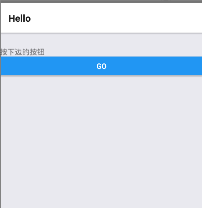
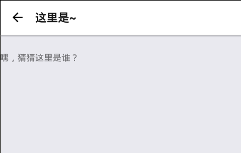

# 导航器

一个应用（普通的那种），总是有好多个界面，只有一个界面的应用怎么能留得住用户呢？（虽然有很多界面的也不一定留得住）
所以说，做应用一般不会只做一个页面。我们知道，网页之间可以自由跳转，通过一个`<a></a>`就可以搞定了，但是
开发应用不是写网页，React Native中也没有`<a>`，那当我们需要做界面跳转的时候该怎么办呢？答案是使用`Navigator`组件。
哈哈，逗你的，在0.42版本前使用`Navigator`来实现导航效果没问题，不过呢，自从0.43版本之后React Native将停止维护这个组件了，
因为出现了更好用的`React Navigation`。

首先我们来安装它：

```
npm install --save react-navigation
```

然后重新启动你的应用

作者君在安装这个库的时候，它的版本是beta7,有一个小bug需要处理一下，删掉`node_modules/react-navigation/src/views/Header.js`的第12行，

```
import ReactComponentWithPureRenderMixin from 'react/lib/ReactComponentWithPureRenderMixin';
````

不然直接红屏报错。

安装完毕后，我们来一个简单的例子，首先我们需要引入它：

```
import { StackNavigator } from 'react-navigation';
```

然后写两个组件，一个叫`HelloScreen`，一个叫`UserScreen`：

```
class HelloScreen extends Component {
  static navigationOptions = {
    title: 'Hello',
  };
  render() {
    const { navigate } = this.props.navigation;
    return (
      <View>
        <Text>{'\n'}</Text>
        <Text>按下边的按钮</Text>
        <Button
          onPress={() => navigate('User')}
          title="Go"
        />
      </View>
    );
  }}

  class UserScreen extends Component {
  static navigationOptions = {
    title: '这里是~',
  };
  render() {
    return (
      <View>
        <Text>{'\n'}</Text>
        <Text>嘿，猜猜这里是谁？</Text>
      </View>
    );
  }
}

```

这两个组件和正常的组件差不多，不过是多了些东西罢了。其中，`navigationOptions`数组里可以放些配置信息，一般用来配置Header部分。
HelloScreen里的`const { navigate } = this.props.navigation`是为了可以在组件中使用`navigate`方法。`navigate(...)`理解成
跳转到那个界面就好。不过，光有这两个组件可看不出来什么，我们还需要一个`StackNavigator`来使导航可以正常运作。（可以把这个当成一个特殊的组件，更好理解）：

```
const MyApp = StackNavigator({
  Home: { screen: HelloScreen },
  User: { screen: UserScreen },
});
```

这里的`Home`和`User`是路由别名，在使用`navigate`时需要用到。然后改一下注册的组件，就像下边那样：

```
AppRegistry.registerComponent('AppName', () => MyApp);
```

好啦，我们刷新一下应用：



然后点一下Go按钮：



就像这样，轻轻松松便实现了导航效果。
